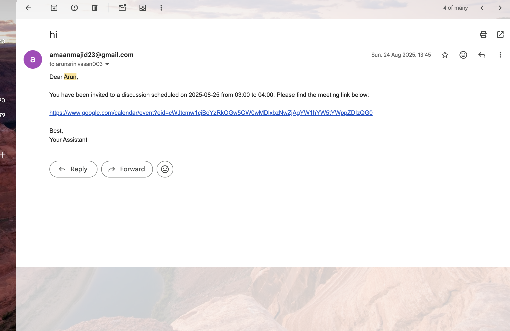

# 🤖 AI-Powered Meeting Scheduler & MoM Generator

A comprehensive **Multi-Agent MCP-based system** that automates meeting scheduling, email management, and generates professional Minutes of Meeting (MoM) using AI. Built with **FastMCP**, **LlamaIndex**, and **Google APIs**. Supports **WhatsApp** and **Telegram** bot interfaces for natural language interaction.

## ✨ Features

### 📅 **Smart Calendar Management**
- **Availability Checking**: Check free slots for specific dates/times
- **Schedule Viewing**: Get complete daily schedules
- **Automated Scheduling**: AI-powered meeting scheduling with conflict detection
- **Google Calendar Integration**: Seamless sync with your Google Calendar
- **Flexible Scheduling**: Schedule meetings for today, tomorrow, or specific dates

### 📧 **Intelligent Email System**
- **Automatic Invitations**: Send meeting invites when scheduling
- **Custom Recipients**: Support for multiple participants via contacts.txt
- **Gmail API Integration**: Professional email management
- **Template Support**: Structured email formatting
- **Contact Management**: Easy lookup from contacts.txt file

### 📝 **AI-Powered MoM Generation**
- **Transcript to MoM**: Convert meeting transcripts to structured Minutes of Meeting
- **Smart Formatting**: Includes Agenda, Key Points, Decisions, and Action Items
- **Automated Distribution**: Send generated MoM to participants via email
- **Groq LLM Integration**: High-quality AI processing using Llama 3.1

### 💬 **Multi-Platform Bot Interfaces**
- **WhatsApp Bot**: Natural language interaction via WhatsApp Business API
- **Telegram Bot**: Full-featured Telegram bot integration
- **Webhook Support**: Secure webhook verification for WhatsApp
- **Real-time Processing**: Instant message handling and responses

### 🔧 **MCP Architecture**
- **Modular Design**: Separate servers for Calendar, Gmail, and MoM
- **Multi-Agent System**: LlamaIndex FunctionAgent for intelligent interactions
- **FastMCP Framework**: High-performance MCP server implementation
- **Extensible Tools**: Easy to add new functionality
- **SSE Support**: Server-Sent Events for real-time communication

---

## 🚀 Quick Start

### Prerequisites
- **Python 3.10+**
- **Google Calendar API** credentials
- **Gmail API** credentials  
- **Groq API Key** for MoM generation
- **WhatsApp Business API** credentials (for WhatsApp bot)
- **Telegram Bot Token** (for Telegram bot)

### Installation

1. **Clone the repository**
```bash
git clone https://github.com/arun-sr07/Meeting-Scheduler.git
cd Meeting-Scheduler
```

2. **Install dependencies**
```bash
pip install -r requirements.txt
```

3. **Set up environment variables**
```bash
# Copy example.env to .env
cp example.env .env

# Edit .env and add your API keys
```

4. **Configure Google APIs**
```bash
# Run setup scripts to authenticate with Google
python setup_google_calendar.py
python setup_email.py
```

5. **Set up contacts**
```bash
# Edit contacts.txt with your contacts
# Format: Name=email@example.com
```

---

## 🛠️ Configuration

### Environment Variables

Create a `.env` file in the project root with the following variables:

```env
# Groq API Key (Required for AI features)
GROQ_API_KEY=your_groq_api_key_here

# Telegram Bot (Required for Telegram bot)
TELEGRAM_API_KEY=your_telegram_bot_token_here

# WhatsApp Business API (Required for WhatsApp bot)
ACCESS_TOKEN=your_whatsapp_access_token
APP_ID=your_app_id
APP_SECRET=your_app_secret
RECIPIENT_WAID=+1234567890  # Your WhatsApp number with country code
VERSION=v22.0
PHONE_NUMBER_ID=your_phone_number_id
VERIFY_TOKEN=your_verify_token
```

### Required Files

- `token_calendar.json` - Google Calendar API credentials (generated by setup_google_calendar.py)
- `token_gmail.json` - Gmail API credentials (generated by setup_email.py)
- `contacts.txt` - Contact information for participants
- `.env` - Environment variables (not tracked in git)


## 📖 Usage

### Starting the Application

#### Option 1: WhatsApp Bot (Recommended)

Start all services at once:
```bash
python start_whatsapp_bot.py
```

This will start:
- Calendar MCP server (port 8080)
- Gmail MCP server (port 8051)
- MoM MCP server (port 8081)
- Flask WhatsApp app (port 8000)

#### Option 2: Telegram Bot

Start all services at once:
```bash
python start_telegram_bot.py
```

This will start:
- Calendar MCP server (port 8080)
- Gmail MCP server (port 8000)
- MoM MCP server (port 8081)
- Telegram bot

#### Option 3: Manual Start

Start MCP servers individually:
```bash
# Terminal 1: Calendar Server
python calendarServer.py --server_type sse

# Terminal 2: Gmail Server
python gmailServer.py --server_type sse

# Terminal 3: MoM Server
python momServer.py --server_type sse

# Terminal 4: WhatsApp Bot
python run.py

# OR Terminal 4: Telegram Bot
python telegram_bot.py
```

### WhatsApp Bot Usage

Send messages to your WhatsApp bot:

#### Availability & Scheduling

- `"schedule meeting today at 2:00 PM"`
- `"schedule meeting tomorrow"`
- `"what's my schedule on 2025-10-25"`

#### Email & Communication
- `"send email to arun"`
- `"generate mom from transcript"`

#### Commands
- `"help"` - Show available commands
- `"status"` - Check if bot is working

### Telegram Bot Usage

Send messages to your Telegram bot:

#### Availability & Scheduling

- `"schedule meeting today at 2:00 PM"`
- `"schedule meeting tomorrow"`
- `"what's my schedule on 2025-10-25"`

#### Email & Communication

- `"generate mom from transcript"`

#### Commands
- `/start` - Welcome message
- `/help` - Show available commands

### MCP Client (Standalone)

Run the MCP client directly:
```bash
python mcp_client.py
```

---

## 🏗️ Architecture

### System Architecture

```
┌─────────────────┐    ┌─────────────────┐    ┌─────────────────┐
│  Calendar       │    │  Gmail          │    │  MoM            │
│  Server         │    │  Server         │    │  Server         │
│  (MCP)          │    │  (MCP)          │    │  (MCP)          │
│  Port: 8080     │    │  Port: 8051     │    │  Port: 8081     │
└─────────────────┘    └─────────────────┘    └─────────────────┘
         │                       │                       │
         └───────────────────────┼───────────────────────┘
                                 │
                    ┌─────────────────┐
                    │  MCP Client     │
                    │  (Multi-Agent)  │
                    │  LlamaIndex     │
                    └─────────────────┘
                                 │
                    ┌─────────────────┐
                    │  Bot Interface  │
                    │  WhatsApp/      │
                    │  Telegram       │
                    └─────────────────┘
```

### WhatsApp Bot Flow

```
WhatsApp Users
    ↓
WhatsApp Business API
    ↓
Flask App (run.py) → /webhook endpoint
    ↓
WhatsApp Utils (whatsapp_utils.py)
    ↓
MCP Client Service (mcp_client_service.py)
    ↓
MCP Servers:
    ├── Calendar Server (calendarServer.py)
    ├── Gmail Server (gmailServer.py)
    └── MoM Server (momServer.py)
```

### Telegram Bot Flow

```
Telegram Users
    ↓
Telegram Bot API
    ↓
Telegram Bot (telegram_bot.py)
    ↓
MCP Client (mcp_client.py logic)
    ↓
MCP Servers:
    ├── Calendar Server (calendarServer.py)
    ├── Gmail Server (gmailServer.py)
    └── MoM Server (momServer.py)
```

### Project Structure

```
Meeting-Scheduler/
├── app/                          # Flask application
│   ├── __init__.py              # Flask factory pattern
│   ├── config.py                # Configuration management
│   ├── views.py                 # Webhook endpoints
│   ├── decorators/
│   │   └── security.py          # Webhook signature validation
│   ├── services/
│   │   ├── mcp_client_service.py  # WhatsApp MCP client
│   │   └── openai_service.py      # OpenAI integration (legacy)
│   └── utils/
│       └── whatsapp_utils.py    # WhatsApp utilities
├── start/                        # Quickstart scripts
│   ├── assistants_quickstart.py
│   └── whatsapp_quickstart.py
├── calendarServer.py             # Calendar MCP server
├── gmailServer.py               # Gmail MCP server
├── momServer.py                 # MoM MCP server
├── mcp_client.py                # Standalone MCP client
├── telegram_bot.py              # Telegram bot
├── run.py                       # Flask app entry point
├── start_whatsapp_bot.py        # WhatsApp bot launcher
├── start_telegram_bot.py        # Telegram bot launcher
├── setup_google_calendar.py     # Google Calendar setup
├── setup_email.py               # Gmail setup
├── contacts.txt                 # Contact list
├── requirements.txt             # Dependencies
├── README.md                    # This file
├── WHATSAPP_SETUP.md            # WhatsApp setup guide
├── TELEGRAM_SETUP.md            # Telegram setup guide
└── example.env                  # Environment variables template
```

---

## 🔌 API Endpoints

### WhatsApp Webhook

- **GET** `/webhook` - Webhook verification
- **POST** `/webhook` - Receive WhatsApp messages

### MCP Tools

#### Calendar Operations
- `check_availability(date, time)` - Check free slots
- `get_schedule(date)` - Get daily schedule
- `schedule_meeting(title, date, time, duration, attendees)` - Schedule meeting
- `schedule_meeting_today(start_time, end_time, title, attendees)` - Schedule for today
- `schedule_meeting_tomorrow(start_time, end_time, title, attendees)` - Schedule for tomorrow

#### Email Operations
- `send_email(to, subject, body)` - Send email
- `send_email_to_person(name, subject, body)` - Send email to contact
- `send_meeting_invite(attendees, meeting_details)` - Send meeting invitation

#### MoM Operations
- `generate_mom(transcript)` - Generate MoM from transcript
- `send_mom(names, transcript)` - Generate and send MoM via email

---

## 📦 Dependencies

### Core MCP Framework
- `mcp>=1.0.0` - MCP protocol implementation
- `fastmcp>=1.0.0` - High-performance MCP server

### Google APIs
- `google-api-python-client` - Google Calendar & Gmail APIs
- `google-auth-httplib2` - Authentication
- `google-auth-oauthlib` - OAuth2 support

### AI & LLM
- `llama-index-core` - LlamaIndex framework
- `llama-index-llms-groq` - Groq LLM integration
- `llama-index-llms-ollama` - Ollama LLM integration (optional)
- `llama-index-tools-mcp` - MCP tool integration

### Bot Integrations
- `python-telegram-bot` - Telegram bot framework
- `flask` - Flask web framework for WhatsApp webhook
- `requests` - HTTP requests
- `aiohttp` - Async HTTP client

### Utilities
- `python-dotenv` - Environment variable management
- `dateparser` - Date parsing utilities
- `nest-asyncio` - Async support

---

## 🔐 Security

- **API Keys**: Stored in environment variables, never hardcoded
- **OAuth2**: Secure Google API authentication
- **Webhook Verification**: Signature validation for WhatsApp webhooks
- **Git Protection**: Sensitive files excluded from version control
- **HTTPS**: Required for production webhook URLs

---

## 🌐 Webhook Configuration

### WhatsApp Webhook Setup

1. **Local Development** (using ngrok)
```bash
# Install ngrok from https://ngrok.com/
ngrok http 8000

# Use the ngrok URL as your webhook URL
# Example: https://abc123.ngrok.io/webhook
```

2. **Production Deployment**
- Deploy Flask app to cloud service (Heroku, AWS, etc.)
- Use production URL as webhook endpoint
- Configure in Meta for Developers dashboard

3. **Webhook Configuration**
- **Webhook URL**: `https://your-domain.com/webhook`
- **Verify Token**: Must match `VERIFY_TOKEN` in `.env`
- **Subscription Fields**: `messages`, `messaging_postbacks`

### Meta for Developers Setup

1. Go to [Meta for Developers](https://developers.facebook.com/)
2. Create a new app and add WhatsApp Business API
3. Get your access token, app ID, app secret, and phone number ID
4. Configure webhook URL and verify token
5. Subscribe to webhook fields


## 📸 Screenshots


---
